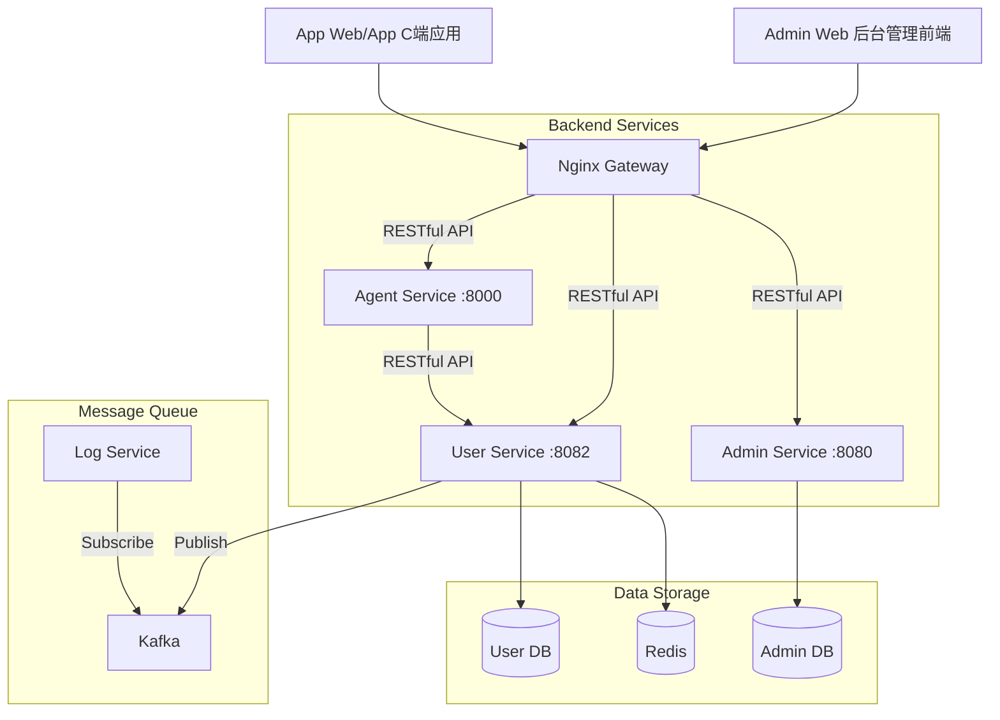

# 用户中心（user-service）管理模块架构设计方案 (微服务版)

## 1. 架构概述

本架构设计基于微服务理念，将用户中心模块 (`app-user`) 独立为 `user-service`，以应对 C 端用户的高并发、高可用及快速迭代需求。

## 2. 系统拓扑图



## 3. 关键组件交互

### 3.1 流量入口
*   **Nginx Gateway**: 负责请求路由转发，所有请求均采用 **RESTful API** 风格。
    *   `/api/v1/admin/**` -> `admin-service` (后台管理相关接口)
    *   `/api/v1/app-users/**`, `/api/v1/user-tags/**`, `/api/v1/user-fields/**` -> `user-service` (C端用户相关接口)
    *   `/api/v1/agent/**` -> `agent-service` (智能体相关接口)

### 3.2 服务间调用
*   **Agent Service -> User Service**:
    *   场景：智能体获取当前对话用户的画像信息（标签、偏好）。
    *   方式：**RESTful API** (HTTP)。
*   **Admin Service 与 User Service 无直接调用**:
    *   后台管理前端需要管理 C 端用户时，**直接通过网关调用 User Service 的 API**。
    *   两个服务完全独立，各自拥有独立的数据库和业务逻辑。

### 3.3 数据流转
1.  **用户注册/登录**: C 端用户请求 -> Nginx -> `user-service` -> 写库 -> 发送 Kafka 消息 (Topic: `user-events`)。
2.  **日志审计**: `user-service` 操作日志 -> Kafka -> `log-service` -> Elasticsearch。

## 4. 部署架构

### 4.1 容器化部署
每个服务独立打包为 Docker 镜像，通过 Docker Compose 或 K8s 进行编排。

```yaml
version: '3.8'
services:
  # 基础组件
  mysql:
    image: mysql:8.4.8
    environment:
      MYSQL_ROOT_PASSWORD: root
      MYSQL_DATABASE: trae_user
  
  redis:
    image: redis:7.4.8
  
  zookeeper:
    image: wurstmeister/zookeeper
  
  kafka:
    image: wurstmeister/kafka
    environment:
      KAFKA_ADVERTISED_HOST_NAME: kafka
      KAFKA_ZOOKEEPER_CONNECT: zookeeper:2181
  
  # 业务服务
  user-service:
    image: trae/user-service:latest
    ports:
      - "8082:8082"
    environment:
      MYSQL_HOST: mysql
      MYSQL_PORT: 3306
      MYSQL_DATABASE: trae_user
      MYSQL_USERNAME: root
      MYSQL_PASSWORD: root
      REDIS_HOST: redis
      REDIS_PORT: 6379
      KAFKA_BOOTSTRAP_SERVERS: kafka:9092
    depends_on:
      mysql:
        condition: service_healthy
      redis:
        condition: service_healthy
      kafka:
        condition: service_started
```

### 4.2 数据库拆分
*   **Admin DB**: `sys_user`, `sys_role`, `sys_menu` 等后台管理表。
*   **User DB**: `app_user`, `user_tag`, `user_field` 等 C 端用户表。

## 5. 扩展性设计

*   **水平扩展**: `user-service` 无状态设计，可随时增加实例应对流量高峰。
*   **读写分离**: 针对 C 端读多写少的场景，可配置 MySQL 主从复制，`user-service` 读操作走从库。
*   **缓存策略**: 热点用户数据（如 Token、基础信息）强依赖 Redis 缓存，减少 DB 压力。
