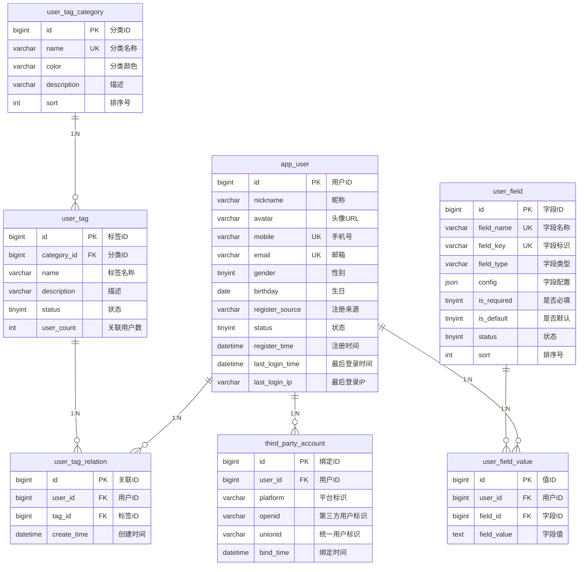

# 用户中心（user-service）模块后端设计方案 (微服务版)

## 1. 设计概述

本设计方案基于 `APP_USER_PRD.md` 需求文档，旨在实现前台用户（C端用户）的管理功能。鉴于 C 端用户体系的高并发、高扩展性特征，以及与后台管理系统的业务解耦需求，本模块将作为独立的微服务 `user-service` 进行开发和部署。

## 2. 服务架构

### 2.1 服务定位
*   **服务名称**: `user-service`
*   **端口**: 8082 (暂定)
*   **职责**: 负责 C 端用户的注册、登录、信息管理、标签管理、自定义字段管理等核心用户域功能。
*   **依赖**:
    *   MySQL: 存储用户基础数据、标签、字段定义及值。
    *   Redis: 缓存用户信息、Token、验证码等。
    *   Kafka (可选): 发布用户注册、登录等事件，供其他服务（如积分、营销）消费。

### 2.2 技术栈
*   **框架**: Spring Boot 3.2.x
*   **ORM**: MyBatis Plus 3.5.x
*   **数据库**: MySQL 8.0+
*   **缓存**: Redis 7.x
*   **接口文档**: SpringDoc OpenAPI 3.0
*   **工具**: Hutool, Lombok, MapStruct

## 3. 模块结构

代码将位于 `services/user-service` 目录下，采用标准的微服务分层架构。

```
com.trae.user
├── common              // 公共模块 (Result, Exception, Utils)
├── config              // 配置类 (Swagger, MyBatis, Redis, WebMvc)
├── controller          // 控制层
│   ├── AppUserController.java       // 用户管理
│   ├── AppUserTagController.java    // 标签管理
│   └── AppUserFieldController.java  // 字段管理
├── service             // 业务逻辑层
│   ├── AppUserService.java
│   ├── AppUserTagService.java
│   ├── AppUserFieldService.java
│   └── impl            // 业务逻辑实现
├── mapper              // 数据访问层
│   ├── AppUserMapper.java
│   ├── AppUserTagMapper.java
│   ├── AppUserTagCategoryMapper.java
│   ├── AppUserTagRelationMapper.java
│   ├── AppUserFieldMapper.java
│   └── AppUserFieldValueMapper.java
├── entity              // 数据库实体
│   ├── AppUser.java
│   ├── AppUserTag.java
│   ├── AppUserTagCategory.java
│   ├── AppUserTagRelation.java
│   ├── AppUserField.java
│   └── AppUserFieldValue.java
├── dto                 // 数据传输对象
│   ├── AppUserQueryDTO.java         // 用户查询条件
│   ├── AppUserTagDTO.java           // 标签创建/更新
│   ├── AppUserFieldDTO.java         // 字段创建/更新
│   ├── BatchTagDTO.java             // 批量打标签
│   └── UserStatusDTO.java           // 用户状态更新
└── vo                  // 视图对象
    ├── AppUserVO.java               // 用户列表/详情展示
    ├── AppUserTagVO.java            // 标签展示
    └── AppUserFieldVO.java          // 字段展示
```

## 4. 数据模型设计 (Entity)

基于 MyBatis Plus 注解，对应数据库表结构。

### 4.1 AppUser (前台用户)
```java
@Data
@TableName("app_user")
public class AppUser {
    @TableId(type = IdType.AUTO)
    private Long id;
    private String nickname;
    private String avatar;
    private String mobile;
    private String email;
    private Integer gender;
    private LocalDate birthday;
    private String registerSource;
    private Integer status;
    private LocalDateTime registerTime;
    private LocalDateTime lastLoginTime;
    private String lastLoginIp;
    
    @TableLogic
    private Integer isDeleted;
    
    @TableField(fill = FieldFill.INSERT)
    private LocalDateTime createTime;
    
    @TableField(fill = FieldFill.INSERT_UPDATE)
    private LocalDateTime updateTime;
}
```

### 4.2 AppUserTag (用户标签)
```java
@Data
@TableName("user_tag")
public class AppUserTag {
    @TableId(type = IdType.AUTO)
    private Long id;
    private Long categoryId;
    private String name;
    private String description;
    private Integer status;
    private Integer userCount;
    
    @TableLogic
    private Integer isDeleted;
    // ... createTime, updateTime
}
```

### 4.3 AppUserField (用户字段定义)
```java
@Data
@TableName("user_field")
public class AppUserField {
    @TableId(type = IdType.AUTO)
    private Long id;
    private String fieldName;
    private String fieldKey;
    private String fieldType; // RADIO, CHECKBOX, TEXT, LINK
    
    @TableField(typeHandler = JacksonTypeHandler.class)
    private Object config; // JSON 配置
    
    private Integer isRequired;
    private Integer isDefault;
    private Integer status;
    private Integer sort;
    
    @TableLogic
    private Integer isDeleted;
    // ... createTime, updateTime
}
```

### 4.4 AppUserFieldValue (用户字段值)
```java
@Data
@TableName("user_field_value")
public class AppUserFieldValue {
    @TableId(type = IdType.AUTO)
    private Long id;
    private Long userId;
    private Long fieldId;
    private String fieldValue; // 存储值，多选为JSON数组字符串
    // ... createTime, updateTime
}
```

## 5. 接口设计 (Controller)

### 5.1 用户管理 (AppUserController)

| 方法 | URL | 描述 | 权限 |
| :--- | :--- | :--- | :--- |
| GET | `/api/v1/app-users` | 分页查询用户列表 | `app:user:list` |
| GET | `/api/v1/app-users/{id}` | 获取用户详情 | `app:user:view` |
| PUT | `/api/v1/app-users/{id}/status` | 更新用户状态 | `app:user:status` |
| POST | `/api/v1/app-users/{id}/tags` | 为用户分配标签 | `app:user:tag` |
| POST | `/api/v1/app-users/batch-tags` | 批量打标签 | `app:user:tag` |
| DELETE | `/api/v1/app-users/batch-tags` | 批量移除标签 | `app:user:tag` |
| POST | `/api/v1/app-users/export` | 根据筛选条件导出用户列表 | `app:user:export` |
| GET | `/api/v1/app-users/{userId}/field-values` | 获取用户扩展字段值 | `app:user:view` |
| PUT | `/api/v1/app-users/{userId}/field-values` | 更新用户扩展字段值 | `app:user:edit` |

### 5.2 标签管理 (AppUserTagController)

| 方法 | URL | 描述 | 权限 |
| :--- | :--- | :--- | :--- |
| GET | `/api/v1/tag-categories` | 获取标签分类 | `app:tag:list` |
| POST | `/api/v1/tag-categories` | 创建标签分类 | `app:tag:add` |
| GET | `/api/v1/user-tags` | 获取标签列表 | `app:tag:list` |
| POST | `/api/v1/user-tags` | 创建标签 | `app:tag:add` |
| PUT | `/api/v1/user-tags/{id}` | 更新标签 | `app:tag:edit` |
| DELETE | `/api/v1/user-tags/{id}` | 删除标签 | `app:tag:delete` |
| GET | `/api/v1/user-tags/{id}/users` | 获取标签下用户 | `app:tag:view` |

### 5.3 字段管理 (AppUserFieldController)

| 方法 | URL | 描述 | 权限 |
| :--- | :--- | :--- | :--- |
| GET | `/api/v1/user-fields` | 获取字段列表 | `app:field:list` |
| GET | `/api/v1/user-fields/enabled` | 获取启用字段(用于前端渲染) | `app:user:view` |
| POST | `/api/v1/user-fields` | 创建字段 | `app:field:add` |
| PUT | `/api/v1/user-fields/{id}` | 更新字段 | `app:field:edit` |
| DELETE | `/api/v1/user-fields/{id}` | 删除字段 | `app:field:delete` |
| PUT | `/api/v1/user-fields/sort` | 字段排序 | `app:field:sort` |

## 6. 业务逻辑核心点

### 6.1 标签管理逻辑
*   **标签删除**：删除标签时，需同步删除 `user_tag_relation` 表中的关联数据。
*   **批量操作**：批量打标签/移除标签时，需考虑事务处理，确保数据一致性。
*   **用户数统计**：标签表中的 `user_count` 字段建议通过定时任务或事件监听异步更新，避免实时计算影响性能。

### 6.2 自定义字段逻辑
*   **字段Key校验**：创建/更新字段时，必须校验 `fieldKey` 是否与系统保留字段（如 `mobile`, `email` 等）冲突。
*   **字段值存储**：
    *   `RADIO` / `TEXT` / `LINK` 类型直接存储字符串。
    *   `CHECKBOX` 类型存储 JSON 数组字符串。
*   **字段删除**：删除字段时，需同步删除 `user_field_value` 表中对应 `fieldId` 的所有数据（**高风险操作**）。
*   **默认字段**：系统初始化时预置默认字段，`is_default=1`，此类字段不允许删除和禁用，但允许修改排序。
*   **字段排序规则**：
    *   昵称、头像固定排序号为 1、2，始终排在最前面
    *   其他默认字段排序号从 101 开始
    *   新增自定义字段时，系统自动计算排序号 = 当前最大排序号 + 1
    *   用户列表按排序号升序展示字段

### 6.3 数据权限与安全
*   **敏感数据脱敏**：用户列表接口返回的 `mobile` 和 `email` 字段需进行脱敏处理（如 `138****8888`）。
*   **权限控制**：所有写操作接口需添加 `@PreAuthorize` 注解进行权限校验。

## 7. 数据库设计

### 7.1 数据库概述
*   **数据库名称**: `trae_user`
*   **字符集**: `utf8mb4`
*   **排序规则**: `utf8mb4_general_ci`

### 7.2 表结构设计

#### 7.2.1 前台用户表 (app_user)

| 字段名               | 类型           | 必填 | 说明                                                     |
| :---------------- | :----------- | :- | :----------------------------------------------------- |
| id                | BIGINT       | Y  | 主键，自增                                                  |
| nickname          | VARCHAR(50)  | Y  | 昵称                                                     |
| avatar            | VARCHAR(255) | N  | 头像URL                                                  |
| mobile            | VARCHAR(20)  | N  | 手机号，唯一索引                                               |
| email             | VARCHAR(100) | N  | 邮箱，唯一索引                                                |
| gender            | TINYINT      | N  | 性别：0未知/1男/2女                                           |
| birthday          | DATE         | N  | 生日                                                     |
| register_source   | VARCHAR(20)  | Y  | 注册来源：APP / H5 / MINIAPP / WECHAT / ALIPAY / QQ / WEIBO |
| status            | TINYINT      | Y  | 状态：1正常/0禁用/2注销，默认1                                     |
| register_time     | DATETIME     | Y  | 注册时间                                                   |
| last_login_time   | DATETIME     | N  | 最后登录时间                                                 |
| last_login_ip     | VARCHAR(50)  | N  | 最后登录IP                                                 |
| create_time       | DATETIME     | Y  | 创建时间                                                   |
| update_time       | DATETIME     | Y  | 更新时间                                                   |
| is_deleted        | TINYINT      | Y  | 逻辑删除：0正常/1删除                                           |

**索引设计**：
*   主键索引：`PRIMARY KEY (id)`
*   唯一索引：`UNIQUE KEY uk_mobile (mobile)`
*   唯一索引：`UNIQUE KEY uk_email (email)`
*   普通索引：`KEY idx_register_time (register_time)`
*   普通索引：`KEY idx_last_login_time (last_login_time)`

#### 7.2.2 标签分类表 (user_tag_category)

| 字段名          | 类型           | 必填 | 说明      |
| :----------- | :----------- | :- | :------ |
| id           | BIGINT       | Y  | 主键，自增   |
| name         | VARCHAR(50)  | Y  | 分类名称，唯一 |
| color        | VARCHAR(20)  | N  | 分类颜色，默认blue |
| description  | VARCHAR(200) | N  | 描述      |
| sort         | INT          | Y  | 排序号，默认0 |
| create_time  | DATETIME     | Y  | 创建时间    |
| update_time  | DATETIME     | Y  | 更新时间    |
| is_deleted   | TINYINT      | Y  | 逻辑删除    |

**索引设计**：
*   主键索引：`PRIMARY KEY (id)`
*   唯一索引：`UNIQUE KEY uk_name (name)`

#### 7.2.3 用户标签表 (user_tag)

| 字段名          | 类型           | 必填 | 说明             |
| :----------- | :----------- | :- | :------------- |
| id           | BIGINT       | Y  | 主键，自增          |
| category_id  | BIGINT       | Y  | 分类ID           |
| name         | VARCHAR(50)  | Y  | 标签名称           |
| description  | VARCHAR(200) | N  | 描述             |
| status       | TINYINT      | Y  | 状态：1启用/0禁用，默认1 |
| user_count   | INT          | Y  | 关联用户数，默认0      |
| create_time  | DATETIME     | Y  | 创建时间           |
| update_time  | DATETIME     | Y  | 更新时间           |
| is_deleted   | TINYINT      | Y  | 逻辑删除           |

**索引设计**：
*   主键索引：`PRIMARY KEY (id)`
*   普通索引：`KEY idx_category_id (category_id)`

#### 7.2.4 用户标签关联表 (user_tag_relation)

| 字段名          | 类型       | 必填 | 说明    |
| :----------- | :------- | :- | :---- |
| id           | BIGINT   | Y  | 主键，自增 |
| user_id      | BIGINT   | Y  | 用户ID  |
| tag_id       | BIGINT   | Y  | 标签ID  |
| create_time  | DATETIME | Y  | 创建时间  |

**索引设计**：
*   主键索引：`PRIMARY KEY (id)`
*   唯一索引：`UNIQUE KEY uk_user_tag (user_id, tag_id)`
*   普通索引：`KEY idx_tag_id (tag_id)`

#### 7.2.5 用户字段定义表 (user_field)

| 字段名          | 类型          | 必填 | 说明                                  |
| :----------- | :---------- | :- | :---------------------------------- |
| id           | BIGINT      | Y  | 主键，自增                               |
| field_name   | VARCHAR(50) | Y  | 字段名称，唯一                             |
| field_key    | VARCHAR(50) | Y  | 字段标识，唯一，仅允许字母、数字、下划线                |
| field_type   | VARCHAR(20) | Y  | 字段类型：RADIO / CHECKBOX / TEXT / LINK |
| config       | JSON        | N  | 字段配置（选项列表、校验规则等）                    |
| is_required  | TINYINT     | Y  | 是否必填：1是/0否，默认0                      |
| is_default   | TINYINT     | Y  | 是否默认字段：1是/0否，默认0                    |
| status       | TINYINT     | Y  | 状态：1启用/0禁用，默认1                      |
| sort         | INT         | Y  | 排序号，默认0                             |
| create_time  | DATETIME    | Y  | 创建时间                                |
| update_time  | DATETIME    | Y  | 更新时间                                |
| is_deleted   | TINYINT     | Y  | 逻辑删除：0正常/1删除                        |

**索引设计**：
*   主键索引：`PRIMARY KEY (id)`
*   唯一索引：`UNIQUE KEY uk_field_name (field_name)`
*   唯一索引：`UNIQUE KEY uk_field_key (field_key)`
*   普通索引：`KEY idx_sort (sort)`

#### 7.2.6 用户字段值表 (user_field_value)

| 字段名          | 类型       | 必填 | 说明               |
| :----------- | :------- | :- | :--------------- |
| id           | BIGINT   | Y  | 主键，自增            |
| user_id      | BIGINT   | Y  | 用户ID             |
| field_id     | BIGINT   | Y  | 字段ID             |
| field_value  | TEXT     | N  | 字段值（多选时存储JSON数组） |
| create_time  | DATETIME | Y  | 创建时间             |
| update_time  | DATETIME | Y  | 更新时间             |

**索引设计**：
*   主键索引：`PRIMARY KEY (id)`
*   唯一索引：`UNIQUE KEY uk_user_field (user_id, field_id)`
*   普通索引：`KEY idx_field_id (field_id)`

#### 7.2.7 第三方账号绑定表 (third_party_account)

| 字段名          | 类型           | 必填 | 说明                        |
| :----------- | :----------- | :- | :------------------------ |
| id           | BIGINT       | Y  | 主键，自增                     |
| user_id      | BIGINT       | Y  | 用户ID                      |
| platform     | VARCHAR(20)  | Y  | 平台：WECHAT/ALIPAY/QQ/WEIBO |
| openid       | VARCHAR(100) | Y  | 第三方用户标识                   |
| unionid      | VARCHAR(100) | N  | 统一用户标识                    |
| bind_time    | DATETIME     | Y  | 绑定时间                      |
| create_time  | DATETIME     | Y  | 创建时间                      |
| update_time  | DATETIME     | Y  | 更新时间                      |

**索引设计**：
*   主键索引：`PRIMARY KEY (id)`
*   唯一索引：`UNIQUE KEY uk_platform_openid (platform, openid)`
*   普通索引：`KEY idx_user_id (user_id)`

### 7.3 ER 图



***

## 8. CI/CD 部署设计

### 8.1 Docker 容器化

#### 8.1.1 Dockerfile 设计

采用多阶段构建，优化镜像大小：

```dockerfile
# 构建阶段：使用 Maven 镜像执行编译和打包
FROM maven:3.9.6-eclipse-temurin-17 AS builder

# 配置代理（可选）
ARG HTTP_PROXY
ARG HTTPS_PROXY
ARG NO_PROXY

ENV HTTP_PROXY=${HTTP_PROXY}
ENV HTTPS_PROXY=${HTTPS_PROXY}
ENV NO_PROXY=${NO_PROXY}

# 配置阿里云 Maven 镜像加速
RUN mkdir -p /root/.m2 && echo '<settings>...</settings>' > /root/.m2/settings.xml

WORKDIR /app
COPY pom.xml .
COPY src ./src
RUN mvn clean package -DskipTests

# 运行阶段：使用轻量级 Java 运行时镜像
FROM amazoncorretto:17-alpine

# 安装必要工具
RUN apk add --no-cache curl fontconfig ttf-dejavu

WORKDIR /app
COPY --from=builder /app/target/*.jar app.jar

EXPOSE 8082
ENTRYPOINT ["java", "-jar", "app.jar"]
```

#### 8.1.2 镜像构建命令

```bash
# 构建镜像
docker build -t trae-admin-user-service:latest ./services/user-service

# 推送到镜像仓库（可选）
docker push trae-admin-user-service:latest
```

### 8.2 Docker Compose 编排

在项目根目录的 `docker-compose.yml` 中配置：

```yaml
services:
  user-service:
    build: ./services/user-service
    container_name: user-service
    environment:
      MYSQL_HOST: mysql
      MYSQL_PORT: 3306
      MYSQL_DATABASE: trae_user
      MYSQL_USERNAME: root
      MYSQL_PASSWORD: root
      REDIS_HOST: redis
      REDIS_PORT: 6379
      KAFKA_BOOTSTRAP_SERVERS: kafka:9092
    ports:
      - "8082:8082"
    networks:
      - trae-net
    healthcheck:
      test: ["CMD", "curl", "-f", "http://localhost:8082/actuator/health"]
      interval: 10s
      timeout: 5s
      retries: 5
    depends_on:
      mysql:
        condition: service_healthy
      redis:
        condition: service_healthy
      kafka:
        condition: service_started
```

### 8.3 部署命令

```bash
# 启动所有服务
docker-compose up -d

# 仅构建并启动 user-service
docker-compose up -d --build user-service

# 查看服务状态
docker-compose ps

# 查看服务日志
docker-compose logs -f user-service

# 停止服务
docker-compose down
```

### 8.4 健康检查

服务启动后，可通过以下方式检查健康状态：

```bash
# 健康检查端点
curl http://localhost:8082/actuator/health

# 预期响应
{
  "status": "UP"
}
```

***

## 9. 依赖与配置

*   **MyBatis Plus**: 使用 `JacksonTypeHandler` 处理 JSON 字段（`config` 字段）。
*   **Validation**: 使用 `@Valid` 和 `@NotNull` 等注解进行参数校验。
*   **Excel导出**: 使用 EasyExcel 或 Hutool POI 进行数据导出。

***

## 10. 微服务交互

*   **Admin Service**: 与 `user-service` 无直接调用关系。后台管理前端需要管理 C 端用户时，直接通过网关调用 `user-service` 的 RESTful API。
*   **Agent Service**: 智能体服务通过 **RESTful API** 调用 `user-service` 获取用户画像信息。
*   **Gateway**: 网关层配置路由规则，将 `/api/v1/app-users/**` 等请求转发至 `user-service`。
