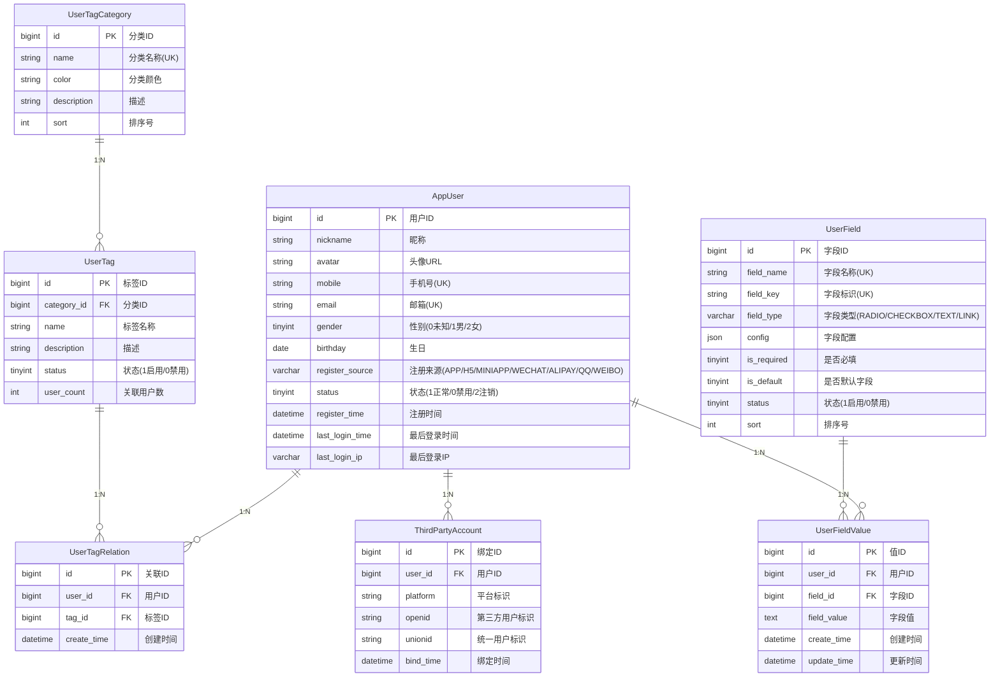

# 用户中心（user-service）模块产品需求文档 (PRD)

| 项目   | 内容         |
| :--- | :--------- |
| 文档版本 | V1.0       |
| 最后更新 | 2026-03-04 |
| 状态   | 初始版        |

### 文档修订记录

| 版本   | 日期         | 修改人     | 说明     |
| :--- | :--------- | :------ | :----- |
| V1.0 | 2026-03-04 | Product | 初始版本创建 |

***

## 1. 模块概述

### 1.1 模块背景

用户中心（user-service）模块是面向 C 端用户的管理系统，用于管理终端用户的基本信息、用户标签、用户画像等数据。与后台管理系统不同，前台用户管理不涉及角色权限分配，而是通过标签体系实现用户分类与精细化运营。

### 1.2 模块定位

* **目标用户**：运营人员、客服人员、数据分析师

* **核心价值**：提供统一的用户数据管理入口，支持用户标签化管理，为精准营销和用户运营提供数据支撑

* **与后台用户的区别**：

| 维度   | 后台用户 (sys\_user) | 前台用户 (app\_user) |
| :--- | :--------------- | :--------------- |
| 用户类型 | 系统管理员、运营人员       | C端终端用户           |
| 认证方式 | 用户名+密码           | 手机号/邮箱+验证码、第三方登录 |
| 权限模型 | RBAC 角色权限        | 无角色概念，基于标签分类     |
| 核心功能 | 用户管理、角色分配        | 用户列表、标签管理、用户画像   |
| 数据隔离 | 独立用户体系           | 独立用户体系           |

### 1.3 核心需求

1. **用户列表管理**：支持用户信息的查询、查看、状态管理
2. **标签体系管理**：支持标签的创建、编辑、删除、分类
3. **用户标签关联**：支持为用户打标签、批量打标签、移除标签
4. **用户画像展示**：聚合展示用户基础信息、行为数据、标签信息
5. **用户表单管理**：支持自定义扩展用户字段，灵活配置用户信息采集项

***

## 2. 功能需求详解

### 2.1 用户列表模块

#### 2.1.1 功能描述

展示和管理所有前台用户的基本信息，支持多维度筛选和操作。

#### 2.1.2 用户列表

* **展示字段**：

  * 用户ID、昵称、头像、手机号（脱敏）、邮箱（脱敏）

  * 注册来源（APP / H5 / MINIAPP / WECHAT / ALIPAY / QQ / WEIBO）

  * 账号状态（正常/禁用/注销）

  * 标签（展示前3个，超出显示+N）

  * 注册时间、最后登录时间

* **筛选条件**：

  * 昵称/手机号（模糊搜索）

  * 注册来源：APP / H5 / MINIAPP / WECHAT / ALIPAY / QQ / WEIBO

  * 账号状态

  * 标签（多选）

  * 注册时间范围

  * 最后登录时间范围

* **筛选栏操作**：

  * **导出**：根据当前筛选条件导出用户数据为 Excel 文件

* **排序规则**：

  * 默认按「最后登录时间」倒序

  * 支持按「注册时间」排序

#### 2.1.3 用户详情

点击用户名行进入详情页，展示完整用户信息：

**基础信息**：

| 字段     | 说明                                                |
| :----- | :------------------------------------------------ |
| 用户ID   | 系统唯一标识                                            |
| 昵称     | 用户昵称                                              |
| 头像     | 用户头像URL                                           |
| 手机号    | 绑定手机号                                             |
| 邮箱     | 绑定邮箱                                              |
| 性别     | 男/女/未知                                            |
| 生日     | 用户生日                                              |
| 注册来源   | APP / H5 / MINIAPP / WECHAT / ALIPAY / QQ / WEIBO |
| 注册时间   | 首次注册时间                                            |
| 最后登录时间 | 最近一次登录时间                                          |
| 最后登录IP | 最近一次登录IP                                          |
| 账号状态   | 正常/禁用/注销                                          |

**标签信息**：

* 展示用户当前所有标签

* 支持添加/移除标签

**第三方账号绑定**：

* 展示已绑定的第三方平台（微信、支付宝、QQ等）

* 显示绑定时间

#### 2.1.4 用户操作

| 操作   | 说明          | 权限标识               |
| :--- | :---------- | :----------------- |
| 查看详情 | 查看用户完整信息    | `app:user:view`    |
| 禁用账号 | 禁用用户账号，禁止登录 | `app:user:disable` |
| 启用账号 | 恢复用户账号状态    | `app:user:enable`  |
| 分配标签 | 为用户添加或移除标签  | `app:user:tag`     |

#### 2.1.5 批量操作

列表下方批量操作栏，支持以下操作：

* **批量打标签**：选中多个用户，批量添加指定标签

* **批量移除标签**：选中多个用户，批量移除指定标签

***

### 2.2 标签管理模块

#### 2.2.1 功能描述

管理用户标签体系，支持标签的分类、创建、编辑、删除等操作。

#### 2.2.2 标签列表

* **展示字段**：

  * 标签名称、标签分类

  * 关联用户数

  * 创建时间、更新时间

  * 状态（启用/禁用）

* **筛选条件**：

  * 标签名称（模糊搜索）

  * 标签分类

  * 状态

* **排序规则**：

  * 默认按「关联用户数」倒序

  * 支持按「创建时间」排序

#### 2.2.3 标签分类管理

标签分类用于组织标签，便于管理和查找。同一分类的标签使用同一种颜色。

**预设分类**：

| 分类名称 | 说明       | 示例标签           |
| :--- | :------- | :------------- |
| 用户属性 | 基于用户基本信息 | VIP用户、新用户、活跃用户 |
| 消费行为 | 基于消费记录   | 高消费、低消费、首购用户   |
| 兴趣偏好 | 基于行为分析   | 数码爱好者、美妆达人     |
| 营销标签 | 运营活动标记   | 双11参与、优惠券敏感    |
| 风控标签 | 风险识别标记   | 异常登录、疑似刷单      |

**分类操作**：

* 新增分类（支持设置分类颜色）

* 编辑分类名称和颜色

* 删除分类（需确保分类下无标签）

* 查看分类下的标签数量

#### 2.2.4 标签操作

| 操作    | 说明             | 权限标识             |
| :---- | :------------- | :--------------- |
| 新增标签  | 创建新标签          | `app:tag:add`    |
| 编辑标签  | 修改标签名称、分类      | `app:tag:edit`   |
| 删除标签  | 删除标签（解除所有用户关联） | `app:tag:delete` |
| 启用/禁用 | 控制标签是否可用       | `app:tag:status` |
| 查看用户  | 查看该标签下的用户列表    | `app:tag:view`   |

#### 2.2.5 标签字段约束

| 字段   | 约束                    |
| :--- | :-------------------- |
| 标签名称 | 必填，同一分类下唯一，长度 2-20 字符 |
| 标签分类 | 必选                    |
| 标签描述 | 选填，最大 200 字符          |

#### 2.2.6 分类字段约束

| 字段   | 约束                                                                                                                                            |
| :--- | :-------------------------------------------------------------------------------------------------------------------------------------------- |
| 分类名称 | 必填，唯一，长度 2-20 字符                                                                                                                              |
| 分类颜色 | 选填，默认 blue，支持 12 种预设颜色：blue（蓝）、green（绿）、orange（橙）、red（红）、purple（紫）、cyan（青）、magenta（洋红）、volcano（火山红）、gold（金）、lime（青柠）、geekblue（极客蓝）、default（灰） |
| 分类描述 | 选填，最大 200 字符                                                                                                                                  |

***

### 2.3 用户标签关联

#### 2.3.1 单用户打标签

* 在用户详情页或列表操作栏点击「分配标签」

* 弹出标签选择器，展示所有启用的标签（按分类分组）

* 支持搜索标签名称

* 勾选/取消勾选标签，实时保存

#### 2.3.2 批量打标签

* 在用户列表勾选多个用户

* 点击「批量打标签」按钮

* 选择要添加的标签（支持多选）

* 确认后批量添加标签

#### 2.3.3 标签自动规则（扩展功能）

支持配置自动打标签规则：

* **条件触发**：满足指定条件自动打标签

* **规则类型**：

  * 注册时间规则：注册N天内的新用户

  * 登录频率规则：N天内登录超过M次

  * 消费金额规则：累计消费超过N元

  * 自定义规则：基于用户属性组合

***

### 2.4 用户表单管理模块

#### 2.4.1 功能描述

支持自定义扩展用户字段，灵活配置用户信息采集项。系统预设默认字段不可修改，管理员可新增自定义字段满足业务需求。

#### 2.4.2 字段类型说明

| 字段类型 | 标识       | 说明           | 示例        |
| :--- | :------- | :----------- | :-------- |
| 单选   | RADIO    | 单选选项，需配置选项列表 | 性别、学历     |
| 多选   | CHECKBOX | 多选选项，需配置选项列表 | 兴趣爱好、技能标签 |
| 文本   | TEXT     | 短文本输入，限制字符数  | 姓名、公司名称   |
| 链接   | LINK     | URL链接格式      | 个人主页、作品链接 |
| 日期   | DATE     | 日期或日期时间格式    | 生日、注册时间   |

#### 2.4.3 默认字段与自定义字段

**默认字段（系统预设，不可修改）**：

| 字段名称   | 字段标识              | 字段类型  | 排序号 | 说明     |
| :----- | :---------------- | :---- | :-- | :----- |
| 昵称     | nickname          | TEXT  | 1   | 用户昵称   |
| 头像     | avatar            | LINK  | 2   | 头像URL  |
| 手机号    | mobile            | TEXT  | 101 | 绑定手机号  |
| 邮箱     | email             | TEXT  | 102 | 绑定邮箱   |
| 性别     | gender            | RADIO | 103 | 性别选项   |
| 生日     | birthday          | DATE  | 104 | 用户生日   |
| 注册来源   | register\_source  | TEXT  | 105 | 注册来源   |
| 注册时间   | register\_time    | DATE  | 105.5| 首次注册时间 |
| 最后登录时间 | last\_login\_time | DATE  | 106 | 最后登录时间 |
| 最后登录IP | last\_login\_ip   | TEXT  | 107 | 最后登录IP |
| 账号状态   | status            | RADIO | 108 | 账号状态   |

**字段排序规则**：

* 昵称、头像固定排序号为 1、2，始终排在最前面

* 其他默认字段排序号从 101 开始

* 新增自定义字段时，系统自动计算排序号 = 当前最大排序号 + 1

* 用户列表按排序号升序展示字段

**自定义字段（管理员创建）**：

* 支持新增、编辑、删除、排序操作

* 字段名称不能与默认字段重复

* 字段标识全局唯一

#### 2.4.4 字段列表

* **展示字段**：

  * 字段名称、字段标识、字段类型

  * 是否必填、是否启用

  * 排序号、创建时间

* **筛选条件**：

  * 字段名称（模糊搜索）

  * 字段类型

  * 是否启用

* **排序规则**：

  * 默认按「排序号」升序

  * 支持拖拽排序

#### 2.4.5 字段操作

| 操作    | 说明                | 权限标识               |
| :---- | :---------------- | :----------------- |
| 新增字段  | 创建自定义字段           | `app:field:add`    |
| 编辑字段  | 修改字段名称、类型、选项等     | `app:field:edit`   |
| 删除字段  | 删除自定义字段（同步删除用户数据） | `app:field:delete` |
| 启用/禁用 | 控制字段是否在表单中展示      | `app:field:status` |
| 字段排序  | 调整字段展示顺序          | `app:field:sort`   |

#### 2.4.6 字段配置规则

**单选/多选字段配置**：

* 必须配置选项列表

* 选项格式：`{"options": [{"label": "选项1", "value": "1"}, {"label": "选项2", "value": "2"}]}`

* 选项数量限制：2-20个

* 选项值不能重复

**文本字段配置**：

* 可配置最大字符数（默认100，最大500）

* 可配置正则校验规则（可选）

**链接字段配置**：

* 系统自动校验URL格式

* 可配置链接类型提示（如：个人主页、作品链接等）

#### 2.4.7 字段约束

| 字段   | 约束                                |
| :--- | :-------------------------------- |
| 字段名称 | 必填，全局唯一，长度 2-20 字符                |
| 字段标识 | 必填，全局唯一，仅允许字母、数字、下划线，长度 2-30 字符   |
| 字段类型 | 必选：RADIO / CHECKBOX / TEXT / LINK |
| 是否必填 | 必选，默认否                            |
| 排序号  | 必填，整数，默认 0                        |
| 字段配置 | JSON格式，根据字段类型不同配置不同               |

#### 2.4.8 用户详情页字段展示

用户详情页按字段排序号依次展示：

1. **默认字段区域**：展示系统预设字段
2. **自定义字段区域**：展示启用的自定义字段

* 禁用的字段不在详情页展示

* 支持在详情页编辑自定义字段值

## 3. 数据模型设计

### 3.1 ER 图



### 3.2 表结构说明

#### 3.2.1 前台用户表 (app\_user)

| 字段名               | 类型           | 必填 | 说明                                                     |
| :---------------- | :----------- | :- | :----------------------------------------------------- |
| id                | BIGINT       | Y  | 主键，自增                                                  |
| nickname          | VARCHAR(50)  | Y  | 昵称                                                     |
| avatar            | VARCHAR(255) | N  | 头像URL                                                  |
| mobile            | VARCHAR(20)  | N  | 手机号，唯一索引                                               |
| email             | VARCHAR(100) | N  | 邮箱，唯一索引                                                |
| gender            | TINYINT      | N  | 性别：0未知/1男/2女                                           |
| birthday          | DATE         | N  | 生日                                                     |
| register\_source  | VARCHAR(20)  | Y  | 注册来源：APP / H5 / MINIAPP / WECHAT / ALIPAY / QQ / WEIBO |
| status            | TINYINT      | Y  | 状态：1正常/0禁用/2注销，默认1                                     |
| register\_time    | DATETIME     | Y  | 注册时间                                                   |
| last\_login\_time | DATETIME     | N  | 最后登录时间                                                 |
| last\_login\_ip   | VARCHAR(50)  | N  | 最后登录IP                                                 |
| create\_time      | DATETIME     | Y  | 创建时间                                                   |
| update\_time      | DATETIME     | Y  | 更新时间                                                   |
| is\_deleted       | TINYINT      | Y  | 逻辑删除：0正常/1删除                                           |

#### 3.2.2 标签分类表 (user\_tag\_category)

| 字段名          | 类型           | 必填 | 说明          |
| :----------- | :----------- | :- | :---------- |
| id           | BIGINT       | Y  | 主键，自增       |
| name         | VARCHAR(50)  | Y  | 分类名称，唯一     |
| color        | VARCHAR(20)  | N  | 分类颜色，默认blue |
| description  | VARCHAR(200) | N  | 描述          |
| sort         | INT          | Y  | 排序号，默认0     |
| create\_time | DATETIME     | Y  | 创建时间        |
| update\_time | DATETIME     | Y  | 更新时间        |
| is\_deleted  | TINYINT      | Y  | 逻辑删除        |

#### 3.2.3 用户标签表 (user\_tag)

| 字段名          | 类型          | 必填 | 说明    |
| :----------- | :---------- | :- | :---- |
| id           | BIGINT      | Y  | 主键，自增 |
| category\_id | BIGINT      | Y  | 分类ID  |
| name         | VARCHAR(50) | Y  | 标签名称  |

\| description  | VARCHAR(200) | N  | 描述             |
\| status       | TINYINT      | Y  | 状态：1启用/0禁用，默认1 |
\| user\_count  | INT          | Y  | 关联用户数，默认0      |
\| create\_time | DATETIME     | Y  | 创建时间           |
\| update\_time | DATETIME     | Y  | 更新时间           |
\| is\_deleted  | TINYINT      | Y  | 逻辑删除           |

#### 3.2.4 用户标签关联表 (user\_tag\_relation)

| 字段名          | 类型       | 必填 | 说明    |
| :----------- | :------- | :- | :---- |
| id           | BIGINT   | Y  | 主键，自增 |
| user\_id     | BIGINT   | Y  | 用户ID  |
| tag\_id      | BIGINT   | Y  | 标签ID  |
| create\_time | DATETIME | Y  | 创建时间  |

**索引设计**：

* 唯一索引：`uk_user_tag(user_id, tag_id)`

* 普通索引：`idx_tag_id(tag_id)`

#### 3.2.5 第三方账号绑定表 (third\_party\_account)

| 字段名          | 类型           | 必填 | 说明                        |
| :----------- | :----------- | :- | :------------------------ |
| id           | BIGINT       | Y  | 主键，自增                     |
| user\_id     | BIGINT       | Y  | 用户ID                      |
| platform     | VARCHAR(20)  | Y  | 平台：WECHAT/ALIPAY/QQ/WEIBO |
| openid       | VARCHAR(100) | Y  | 第三方用户标识                   |
| unionid      | VARCHAR(100) | N  | 统一用户标识                    |
| bind\_time   | DATETIME     | Y  | 绑定时间                      |
| create\_time | DATETIME     | Y  | 创建时间                      |
| update\_time | DATETIME     | Y  | 更新时间                      |

**索引设计**：

* 唯一索引：`uk_platform_openid(platform, openid)`

* 普通索引：`idx_user_id(user_id)`

#### 3.2.6 用户字段定义表 (user\_field)

| 字段名          | 类型          | 必填 | 说明                                  |
| :----------- | :---------- | :- | :---------------------------------- |
| id           | BIGINT      | Y  | 主键，自增                               |
| field\_name  | VARCHAR(50) | Y  | 字段名称，唯一                             |
| field\_key   | VARCHAR(50) | Y  | 字段标识，唯一，仅允许字母、数字、下划线                |
| field\_type  | VARCHAR(20) | Y  | 字段类型：RADIO / CHECKBOX / TEXT / LINK / DATE |
| config       | JSON        | N  | 字段配置（选项列表、校验规则等）                    |
| is\_required | TINYINT     | Y  | 是否必填：1是/0否，默认0                      |
| is\_default  | TINYINT     | Y  | 是否默认字段：1是/0否，默认0                    |
| status       | TINYINT     | Y  | 状态：1启用/0禁用，默认1                      |
| sort         | INT         | Y  | 排序号，默认0                             |
| create\_time | DATETIME    | Y  | 创建时间                                |
| update\_time | DATETIME    | Y  | 更新时间                                |
| is\_deleted  | TINYINT     | Y  | 逻辑删除：0正常/1删除                        |

**索引设计**：

* 唯一索引：`uk_field_name(field_name)`

* 唯一索引：`uk_field_key(field_key)`

* 普通索引：`idx_sort(sort)`

**字段配置示例**：

```json
// 单选/多选字段配置
{
  "options": [
    {"label": "选项1", "value": "1"},
    {"label": "选项2", "value": "2"}
  ]
}

// 文本字段配置
{
  "maxLength": 100,
  "pattern": "^[a-zA-Z0-9]+$",
  "patternMessage": "仅允许字母和数字"
}

// 链接字段配置
{
  "linkType": "个人主页",
  "placeholder": "请输入个人主页链接"
}
```

#### 3.2.7 用户字段值表 (user\_field\_value)

| 字段名          | 类型       | 必填 | 说明               |
| :----------- | :------- | :- | :--------------- |
| id           | BIGINT   | Y  | 主键，自增            |
| user\_id     | BIGINT   | Y  | 用户ID             |
| field\_id    | BIGINT   | Y  | 字段ID             |
| field\_value | TEXT     | N  | 字段值（多选时存储JSON数组） |
| create\_time | DATETIME | Y  | 创建时间             |
| update\_time | DATETIME | Y  | 更新时间             |

**索引设计**：

* 唯一索引：`uk_user_field(user_id, field_id)`

* 普通索引：`idx_field_id(field_id)`

**字段值存储格式**：

| 字段类型     | 存储格式   | 示例                      |
| :------- | :----- | :---------------------- |
| RADIO    | 字符串    | `"1"`                   |
| CHECKBOX | JSON数组 | `["1", "2", "3"]`       |
| TEXT     | 字符串    | `"用户输入的文本内容"`           |
| LINK     | 字符串    | `"https://example.com"` |
| DATE     | 字符串    | `"2026-01-01 10:00:00"` |

***

## 4. 接口设计

### 4.1 用户管理接口

#### 4.1.1 获取用户列表

```
GET /api/v1/app-users
```

**请求参数**：

| 参数名               | 类型       | 必填 | 说明                                                     |
| :---------------- | :------- | :- | :----------------------------------------------------- |
| page              | int      | Y  | 页码，从1开始                                                |
| size              | int      | Y  | 每页数量                                                   |
| keyword           | string   | N  | 搜索关键词（昵称/手机号）                                          |
| registerSource    | string   | N  | 注册来源：APP / H5 / MINIAPP / WECHAT / ALIPAY / QQ / WEIBO |
| status            | int      | N  | 账号状态                                                   |
| tagIds            | string   | N  | 标签ID，多个用逗号分隔（包含任一标签即可）                                 |
| registerStartTime | datetime | N  | 注册开始时间                                                 |
| registerEndTime   | datetime | N  | 注册结束时间                                                 |

**响应示例**：

```json
{
  "code": 200,
  "message": "success",
  "data": {
    "records": [
      {
        "id": 1,
        "nickname": "用户昵称",
        "avatar": "https://xxx.com/avatar.jpg",
        "mobile": "138****8888",
        "registerSource": "APP",
        "status": 1,
        "tags": [
          {"id": 1, "name": "VIP用户", "color": "gold"}
        ],
        "registerTime": "2026-01-01 10:00:00",
        "lastLoginTime": "2026-03-01 15:30:00"
      }
    ],
    "total": 100,
    "current": 1,
    "size": 10
  }
}
```

#### 4.1.2 获取用户详情

```
GET /api/v1/app-users/{id}
```

#### 4.1.3 更新用户状态

```
PUT /api/v1/app-users/{id}/status
```

**请求体**：

```json
{
  "status": 0
}
```

#### 4.1.4 为用户分配标签

```
POST /api/v1/app-users/{id}/tags
```

**请求体**：

```json
{
  "tagIds": [1, 2, 3]
}
```

#### 4.1.5 批量打标签

```
POST /api/v1/app-users/batch-tags
```

**请求体**：

```json
{
  "userIds": [1, 2, 3],
  "tagIds": [1, 2]
}
```

#### 4.1.6 批量移除标签

```
DELETE /api/v1/app-users/batch-tags
```

**请求体**：

```json
{
  "userIds": [1, 2, 3],
  "tagIds": [1, 2]
}
```

#### 4.1.7 导出用户列表

```
POST /api/v1/app-users/export
```

***

### 4.2 标签管理接口

#### 4.2.1 获取标签分类列表

```
GET /api/v1/tag-categories
```

#### 4.2.2 创建标签分类

```
POST /api/v1/tag-categories
```

**请求体**：

```json
{
  "name": "用户属性",
  "description": "基于用户基本信息的标签",
  "sort": 1
}
```

#### 4.2.3 获取标签列表

```
GET /api/v1/user-tags
```

**请求参数**：

| 参数名        | 类型     | 必填 | 说明         |
| :--------- | :----- | :- | :--------- |
| page       | int    | Y  | 页码         |
| size       | int    | Y  | 每页数量       |
| name       | string | N  | 标签名称（模糊搜索） |
| categoryId | long   | N  | 分类ID       |
| status     | int    | N  | 状态         |

#### 4.2.4 创建标签

```
POST /api/v1/user-tags
```

**请求体**：

```json
{
  "categoryId": 1,
  "name": "VIP用户",
  "description": "付费会员用户"
}
```

#### 4.2.5 更新标签

```
PUT /api/v1/user-tags/{id}
```

#### 4.2.6 删除标签

```
DELETE /api/v1/user-tags/{id}
```

#### 4.2.7 获取标签下的用户列表

```
GET /api/v1/user-tags/{id}/users
```

***

### 4.3 字段管理接口

#### 4.3.1 获取字段列表

```
GET /api/v1/user-fields
```

**请求参数**：

| 参数名    | 类型     | 必填 | 说明         |
| :----- | :----- | :- | :--------- |
| page   | int    | Y  | 页码         |
| size   | int    | Y  | 每页数量       |
| name   | string | N  | 字段名称（模糊搜索） |
| type   | string | N  | 字段类型       |
| status | int    | N  | 状态         |

**响应示例**：

```json
{
  "code": 200,
  "message": "success",
  "data": {
    "records": [
      {
        "id": 1,
        "fieldName": "学历",
        "fieldKey": "education",
        "fieldType": "RADIO",
        "config": {
          "options": [
            {"label": "本科", "value": "1"},
            {"label": "硕士", "value": "2"},
            {"label": "博士", "value": "3"}
          ]
        },
        "isRequired": 0,
        "isDefault": 0,
        "status": 1,
        "sort": 1,
        "createTime": "2026-03-04 10:00:00"
      }
    ],
    "total": 10,
    "current": 1,
    "size": 10
  }
}
```

#### 4.3.2 获取所有启用的字段

```
GET /api/v1/user-fields/enabled
```

用于用户详情页展示字段列表。

#### 4.3.3 创建字段

```
POST /api/v1/user-fields
```

**请求体**：

```json
{
  "fieldName": "学历",
  "fieldKey": "education",
  "fieldType": "RADIO",
  "config": {
    "options": [
      {"label": "本科", "value": "1"},
      {"label": "硕士", "value": "2"},
      {"label": "博士", "value": "3"}
    ]
  },
  "isRequired": 0,
  "sort": 1
}
```

#### 4.3.4 更新字段

```
PUT /api/v1/user-fields/{id}
```

**请求体**：

```json
{
  "fieldName": "学历",
  "config": {
    "options": [
      {"label": "本科", "value": "1"},
      {"label": "硕士", "value": "2"},
      {"label": "博士", "value": "3"},
      {"label": "其他", "value": "4"}
    ]
  },
  "isRequired": 1,
  "sort": 2
}
```

#### 4.3.5 删除字段

```
DELETE /api/v1/user-fields/{id}
```

删除字段时会同步删除所有用户的该字段值数据。

#### 4.3.6 更新字段状态

```
PUT /api/v1/user-fields/{id}/status
```

**请求体**：

```json
{
  "status": 0
}
```

#### 4.3.7 字段排序

```
PUT /api/v1/user-fields/sort
```

**请求体**：

```json
{
  "fieldIds": [3, 1, 2, 4]
}
```

按传入的字段ID顺序更新排序号。

#### 4.3.8 获取用户字段值

```
GET /api/v1/app-users/{userId}/field-values
```

**响应示例**：

```json
{
  "code": 200,
  "message": "success",
  "data": [
    {
      "fieldId": 1,
      "fieldName": "学历",
      "fieldKey": "education",
      "fieldType": "RADIO",
      "fieldValue": "2",
      "fieldValueLabel": "硕士"
    },
    {
      "fieldId": 2,
      "fieldName": "兴趣爱好",
      "fieldKey": "hobbies",
      "fieldType": "CHECKBOX",
      "fieldValue": ["1", "3"],
      "fieldValueLabel": "阅读,运动"
    }
  ]
}
```

#### 4.3.9 更新用户字段值

```
PUT /api/v1/app-users/{userId}/field-values
```

**请求体**：

```json
{
  "fieldValues": [
    {"fieldId": 1, "fieldValue": "2"},
    {"fieldId": 2, "fieldValue": ["1", "3"]}
  ]
}
```

***

## 5. 权限设计

### 5.1 权限节点

```
前台用户管理
├── 用户列表
│   ├── 查看用户列表 (app:user:list)
│   ├── 查看用户详情 (app:user:view)
│   ├── 禁用/启用用户 (app:user:status)
│   ├── 分配标签 (app:user:tag)
│   └── 导出用户 (app:user:export)
├── 标签管理
│   ├── 查看标签列表 (app:tag:list)
│   ├── 新增标签 (app:tag:add)
│   ├── 编辑标签 (app:tag:edit)
│   ├── 删除标签 (app:tag:delete)
│   ├── 启用/禁用标签 (app:tag:status)
│   └── 查看标签用户 (app:tag:view)
└── 字段管理
    ├── 查看字段列表 (app:field:list)
    ├── 新增字段 (app:field:add)
    ├── 编辑字段 (app:field:edit)
    ├── 删除字段 (app:field:delete)
    ├── 启用/禁用字段 (app:field:status)
    └── 字段排序 (app:field:sort)
```

<br />

***

## 6. 非功能需求

### 6.1 性能要求

* 用户列表查询响应时间 < 500ms

* 标签列表查询响应时间 < 200ms

* 批量打标签支持 1000 用户以内

### 6.2 安全要求

* 手机号、邮箱脱敏展示

* 敏感操作记录操作日志

* 导出数据需权限控制

### 6.3 数据要求

* 用户数据逻辑删除

* 标签删除时解除用户关联

* 关联用户数实时统计或定时更新

***

## 7. 扩展规划

### 7.1 用户画像（V2.0）

* 用户行为数据采集

* 用户画像标签自动计算

* 用户分群功能

### 7.2 标签规则引擎（V2.0）

* 可视化规则配置

* 定时任务自动打标签

* 规则执行日志

### 7.3 用户积分体系（V3.0）

* 积分获取规则

* 积分消费记录

* 积分等级体系

