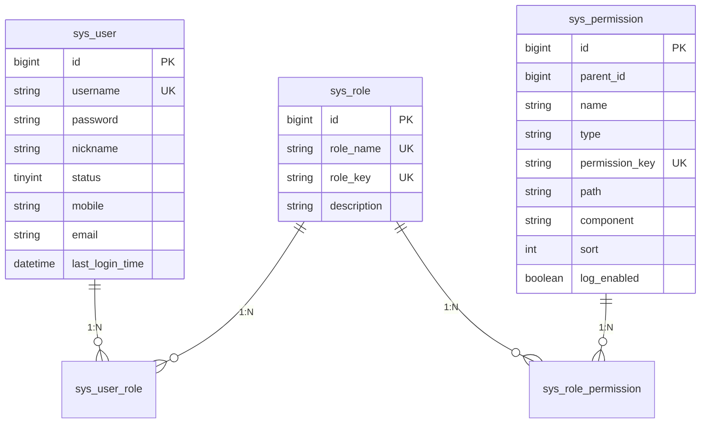
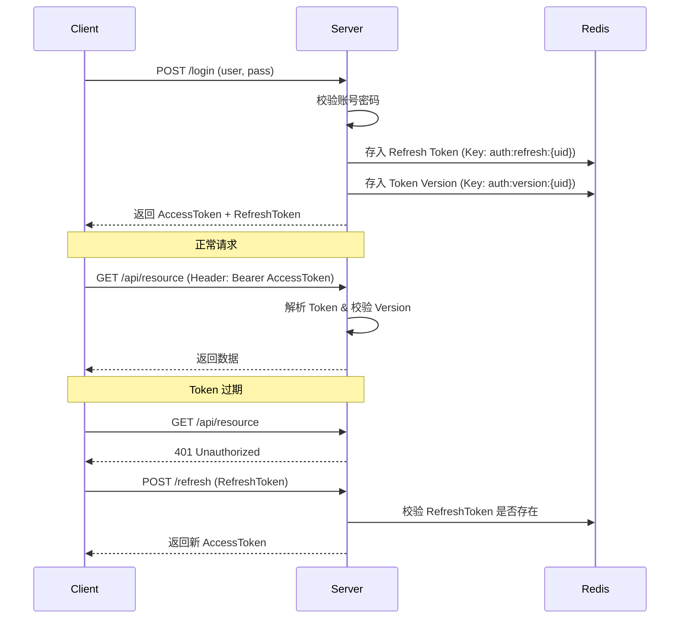
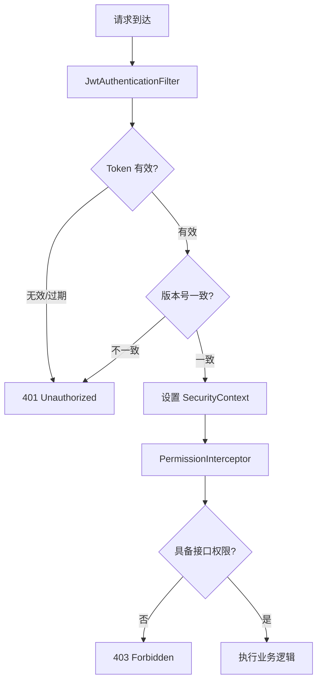

# 后端技术设计方案 (Backend Technical Design)

| 项目 | 内容 |
| :--- | :--- |
| 文档版本 | V1.3 |
| 关联 PRD | V1.2 |
| 关联架构文档 | V1.2 |
| 最后更新 | 2026-01-06 |
| 状态 | 修订版 |

### 文档修订记录
| 版本 | 日期 | 修改人 | 说明 |
| :--- | :--- | :--- | :--- |
| V1.0 | 2026-01-03 | Backend Lead | 初始版本创建 |
| V1.1 | 2026-01-05 | Backend Lead | 重构日志模块：引入 Kafka + Elasticsearch，移除 MySQL 日志表设计。 |
| V1.2 | 2026-01-05 | Backend Lead | 优化日志模块设计：增加 TraceId、批量写入、死信队列及容错降级策略。 |
| V1.3 | 2026-01-06 | Backend Lead | 更新日志模块设计：1. 登录事件仅记录成功事件，不记录登出；2. 操作日志仅记录增删改请求，支持开关配置；3. 明确日志保留策略。 |

## 1. 引言

### 1.1 项目背景与目标
本项目旨在构建一个通用的后台管理系统，提供标准化的用户、角色及权限管理功能（RBAC）。作为业务系统的基础框架，后端需提供稳定、安全、高性能的 API 服务，支持双 Token 认证、动态权限控制及全量操作审计。

### 1.2 文档范围
本文档详细描述后端系统的技术实现细节，包括架构设计、数据库设计、核心功能流程、API 规范及非功能性设计，指导后端开发人员进行编码与实施。

---

## 2. 系统架构设计

### 2.1 技术架构图
采用分层单体架构，结合消息队列实现核心业务与辅助业务（日志）的解耦。

```mermaid
graph TD
    Client[前端/客户端] --> Nginx[Nginx 网关]
    Nginx --> App[Spring Boot 应用]
    
    subgraph "Spring Boot Application"
        Web[Web 层 (Controller)]
        Service[Service 层 (Business Logic)]
        Dao[DAO 层 (MyBatis Plus)]
        MQ[MQ Producer]
        
        Web --> Service
        Service --> Dao
        Service --> MQ
        
        Security[Security Filter Chain] -.-> Web
        Aspect[AOP 切面 (Log/RateLimit)] -.-> Service
    end
    
    subgraph "Log Consumer Service"
        Consumer[Kafka Consumer]
        ES_Repo[ES Repository]
        Consumer --> ES_Repo
    end
    
    Dao --> MySQL[(MySQL 8.0)]
    Service --> Redis[(Redis 7.0)]
    MQ --> Kafka[(Kafka 3.x)]
    Kafka --> Consumer
    ES_Repo --> ES[(Elasticsearch 8.x)]
```

### 2.2 模块划分
系统后端工程按业务域进行模块划分：

*   **Auth (认证模块)**: 处理登录、登出、Token 刷新、黑名单管理。
*   **User (用户模块)**: 用户基础信息管理、状态变更、密码重置。
*   **Role (角色模块)**: 角色 CRUD、权限分配。
*   **Permission (权限模块)**: 菜单/按钮/API 节点的树形结构管理。
*   **Log (日志模块)**: 基于 Kafka + ES 的日志采集与检索。
*   **Common (公共模块)**: 全局异常处理、统一响应封装、工具类。

### 2.3 技术选型
*   **开发语言**: Java 17+
*   **核心框架**: Spring Boot 3.x
*   **ORM 框架**: MyBatis Plus 3.5+
*   **数据库**: MySQL 8.0
*   **日志存储**: Elasticsearch 8.x
*   **消息队列**: Kafka 3.x
*   **缓存/中间件**: Redis 7.x
*   **工具库**: Hutool, Lombok, MapStruct

---

## 3. 数据库详细设计

### 3.1 命名规范与通用字段
*   **表名**: `sys_` 前缀，如 `sys_user`。
*   **主键**: `id` (BigInt, 自增)。
*   **通用字段**:
    *   `create_time` (datetime): 创建时间
    *   `update_time` (datetime): 更新时间
    *   `create_by` (varchar): 创建人
    *   `update_by` (varchar): 更新人
    *   `is_deleted` (tinyint): 逻辑删除 (0:正常, 1:删除)

### 3.2 ER 关系图



### 3.3 MySQL 表结构定义

#### 3.3.1 用户表 (`sys_user`)
| 字段名 | 类型 | 长度 | 必填 | 说明 |
| :--- | :--- | :--- | :--- | :--- |
| id | bigint | 20 | Y | 主键 |
| username | varchar | 50 | Y | 用户名 (UK) |
| password | varchar | 100 | Y | 密码 (BCrypt) |
| nickname | varchar | 50 | Y | 昵称 |
| mobile | varchar | 20 | N | 手机号 |
| email | varchar | 50 | N | 邮箱 |
| status | tinyint | 1 | Y | 状态 (1:启用, 0:禁用) |
| last_login_time | datetime | - | N | 最后登录时间 |
| ... | ... | ... | ... | 通用字段 |

#### 3.3.2 角色表 (`sys_role`)
| 字段名 | 类型 | 长度 | 必填 | 说明 |
| :--- | :--- | :--- | :--- | :--- |
| id | bigint | 20 | Y | 主键 |
| role_name | varchar | 50 | Y | 角色名称 |
| role_key | varchar | 50 | Y | 角色标识 (如 admin) |
| description | varchar | 200 | N | 描述 |
| ... | ... | ... | ... | 通用字段 |

#### 3.3.3 权限表 (`sys_permission`)
| 字段名 | 类型 | 长度 | 必填 | 说明 |
| :--- | :--- | :--- | :--- | :--- |
| id | bigint | 20 | Y | 主键 |
| parent_id | bigint | 20 | Y | 父ID (根节点为0) |
| name | varchar | 50 | Y | 节点名称 |
| type | varchar | 20 | Y | 类型 (DIR/MENU/BTN) |
| permission_key | varchar | 100 | N | 权限标识 (user:add) |
| path | varchar | 200 | N | 路由地址 |
| component | varchar | 200 | N | 组件路径 |
| sort | int | 11 | Y | 排序号 |
| log_enabled | boolean | - | N | 是否开启日志记录（默认true） |
| ... | ... | ... | ... | 通用字段 |

#### 3.3.4 关联表
*   **sys_user_role**: `user_id`, `role_id` (联合主键)
*   **sys_role_permission**: `role_id`, `permission_id` (联合主键)

### 3.4 Elasticsearch 索引设计

#### 3.4.1 日志索引 (`sys_log_yyyy.mm.dd`)
采用按天滚动索引策略。

| 字段名 | 类型 (Type) | 说明 | 索引 (Index) |
| :--- | :--- | :--- | :--- |
| id | keyword | 日志ID (UUID) | true |
| trace_id | keyword | 链路追踪ID | true |
| user_id | long | 操作人ID | true |
| username | keyword | 操作人用户名 | true |
| module | keyword | 模块 | true |
| action | keyword | 动作 | true |
| ip | ip | IP地址 | true |
| params | text | 请求参数 (支持全文检索) | true |
| result | text | 正常响应结果 | false |
| error_msg | text | 异常堆栈信息 (支持全文检索) | true |
| status | keyword | 状态 (SUCCESS/FAIL) | true |
| cost_time | long | 耗时(ms) | true |
| create_time | date | 请求时间 | true |

---

## 4. 核心功能实现方案

### 4.1 认证模块 (Auth)

#### 4.1.1 双 Token 交互流程
采用 Access Token (短效) + Refresh Token (长效) 机制。



#### 4.1.2 强制下线与黑名单
*   **强制下线**: 管理员修改用户状态或重置密码时，自增 Redis 中的 `auth:version:{uid}`。旧 Token 携带的版本号小于 Redis 版本号，请求将被拒绝。
*   **主动登出**: 将当前 Access Token 加入 Redis 黑名单 `auth:blacklist:{jti}`，设置过期时间为 Token 剩余有效期。

### 4.2 用户管理模块 (User)
*   **密码处理**: 禁止明文存储，使用 `BCryptPasswordEncoder` 进行加密。
*   **状态变更**: 修改状态为“禁用”时，同步触发“强制下线”逻辑。
*   **删除逻辑**: 采用逻辑删除 (`is_deleted=1`)，保留数据用于审计。

### 4.3 角色与权限管理 (RBAC)
*   **权限树构建**:
    *   从数据库全量查询权限列表。
    *   使用 Java 内存递归或迭代算法构建树形结构，减少数据库查询次数。
*   **删除校验**:
    *   删除角色前，检查 `sys_user_role` 是否存在关联，存在则报错。
    *   删除权限节点前，检查是否存在子节点，存在则报错或级联删除（建议报错）。

### 4.4 安全鉴权模块 (Security)
#### 4.4.1 请求鉴权流程



*   **动态权限**: 自定义注解 `@PreAuthorize("@ss.hasPerm('user:add')")` 或拦截器模式，从 Redis `sys:user_perms:{uid}` 获取用户权限集合进行比对。

### 4.5 日志模块 (Log)
*   **架构模式**: **Producer-Consumer** 模式。
*   **日志生成机制**:
    *   **登录事件**: 仅记录登录 API 请求成功的固定事件，操作模块固定为"系统认证"，操作事件为"用户登录"，不记录登出事件。
    *   **业务操作事件**: 仅记录带权限标识的 API 请求，支持日志记录开关配置，默认开启。
*   **生产者 (Producer)**: 
    *   **切面逻辑**: 基于 Spring AOP 定义 `@Log` 切面，在 Controller 方法执行前后组装 `LogDTO`。
    *   **异步发送**: 使用 `KafkaTemplate` 异步发送消息至 Topic `sys-log-topic`。
    *   **容错降级**: 配置发送回调 (`ListenableFutureCallback`)，若发送 Kafka 失败，仅记录本地错误日志，**严禁阻断主业务流程**。
    *   **性能配置**: 配置 `acks = 1` (Leader 确认)，平衡性能与可靠性。
    *   **日志过滤规则**: 
        *   仅记录 POST/PUT/DELETE 请求，不记录 GET 请求。
        *   不记录目录、菜单等无权限标识的节点。
        *   不记录不经过后端 API 的权限节点事件。
    *   **开关配置**: `@Log` 注解支持 `enabled` 字段，默认值为 `true`，用于控制是否记录日志。
*   **消费者 (Consumer)**: 
    *   **批量写入**: 开启 Kafka 批量消费模式 (`batchListener=true`)，积攒一定数量（如 50 条）或时间间隔（如 1s）后，调用 ES `Bulk API` 批量写入，减少网络 IO。
    *   **死信队列**: 配置 `DeadLetterPublishingRecoverer`，当 ES 写入持续失败（重试耗尽）时，将消息转存至 `sys-log-topic.DLT`，防止阻塞后续消息消费。
*   **脱敏**: 在生产者组装 DTO 时，对 `password`, `token` 等敏感字段进行掩码处理。
*   **数据独立性**: 日志模块和动作直接从 `@Log` 注解获取，即使后续权限节点被删除或重命名，日志中存储的文本信息不受影响。

#### 4.5.1 日志清理策略
*   **机制**: Elasticsearch **ILM (Index Lifecycle Management)**。
*   **策略配置**:
    *   **Hot Phase**: 索引创建后立即进入热阶段。
    *   **Delete Phase**: 索引创建超过 7 天后，自动删除索引。
*   **执行时间**: 每天凌晨 2 点触发清理。
*   **优势**: 相比 MySQL 的 `DELETE` 语句，ES 的索引删除操作零 IO 开销，不会产生碎片。

### 4.6 数据初始化 (Data Init)
为确保系统部署后开箱即用，实现 `CommandLineRunner` 接口在应用启动后自动检查并初始化数据。

*   **执行逻辑**:
    1.  检查数据库中是否存在超级管理员账号 (`admin`)。
    2.  若不存在，则执行初始化流程：
        *   **初始化权限**: 插入系统管理、用户管理、角色管理等基础菜单及按钮权限。
        *   **初始化角色**: 创建“超级管理员”角色，并关联所有权限。
        *   **初始化用户**: 创建 `admin` 用户，密码经 BCrypt 加密（默认 `123456`），并关联超级管理员角色。


---

## 5. API 接口设计规范

### 5.1 响应结构
```java
public class Result<T> {
    private Integer code; // 200:成功, 500:错误, 401:未认证, 403:无权限
    private String message;
    private T data;
    private Long timestamp;
}
```

### 5.2 异常处理
全局异常处理器 `GlobalExceptionHandler` 捕获以下异常：
*   `MethodArgumentNotValidException`: 参数校验失败 -> 400
*   `BadCredentialsException`: 密码错误 -> 401
*   `AccessDeniedException`: 权限不足 -> 403
*   `BusinessException`: 业务逻辑错误 -> 500 + 错误信息
*   `Exception`: 未知错误 -> 500 + "系统内部错误"

---

## 6. 非功能性设计

### 6.1 安全性
*   **XSS 防护**: 配置 Jackson 序列化器，对 String 类型字段进行 HTML 转义。
*   **SQL 注入**: 严格使用 MyBatis Plus 的 `LambdaQueryWrapper`，禁止手动拼接 SQL。
*   **CORS**: 仅允许前端域名跨域，禁止 `*`。

### 6.2 性能优化
*   **Redis 缓存**:
    *   缓存用户信息及权限列表，TTL 30分钟。
    *   缓存权限树结构，数据变更时主动失效。
*   **连接池**: 使用 HikariCP，根据服务器配置调整最大连接数。

### 6.3 可观测性
*   **TraceId**: 过滤器生成 UUID 作为 TraceId，放入 MDC，并在所有日志中打印，便于链路追踪。

---

## 7. 开发任务分解

### 阶段一：基础框架 (Week 1)
1.  初始化 Spring Boot 工程，集成 MyBatis Plus, Redis, Hutool。
2.  设计并创建 MySQL 数据库表结构。
3.  搭建 Kafka 和 Elasticsearch 开发环境。
4.  封装统一响应结果与全局异常处理。
5.  实现 JWT 工具类与 Redis 基础服务。

### 阶段二：核心业务 (Week 2)
1.  实现 Auth 模块：登录、刷新 Token、退出。
2.  实现 User 模块：CRUD、密码重置。
3.  实现 RBAC 模型：角色与权限的 CRUD 及关联操作。
4.  完成权限拦截器与动态鉴权逻辑。

### 阶段三：完善与交付 (Week 3)
1.  **实现 Log 模块**：
    *   配置 Kafka Producer 与 Consumer。
    *   配置 Spring Data Elasticsearch 索引映射。
    *   实现 AOP 切面发送日志消息。
    *   配置 ES ILM 索引生命周期策略。
2.  集成 Swagger/OpenAPI 文档。
3.  编写单元测试与集成测试。
4.  部署脚本编写与联调。
