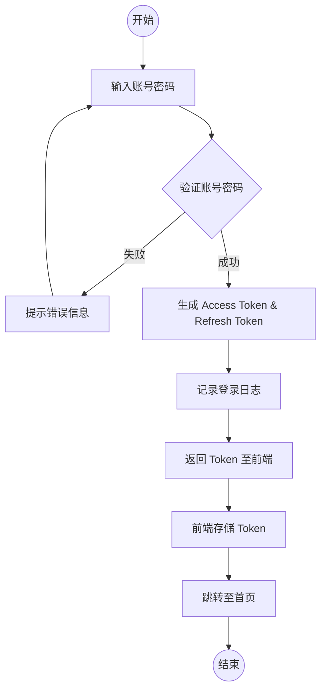
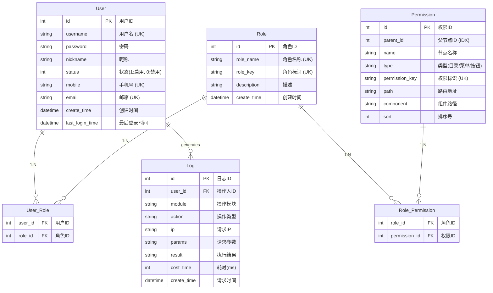

# 后台管理系统产品需求文档 (PRD)

| 项目 | 内容 |
| :--- | :--- |
| 文档版本 | V1.2 |
| 最后更新 | 2026-01-06 |
| 状态 | 修订版 |

### 文档修订记录
| 版本 | 日期 | 修改人 | 说明 |
| :--- | :--- | :--- | :--- |
| V1.1 | 2026-01-02 | Product | 初始版本创建 |
| V1.2 | 2026-01-06 | Product | 更新操作日志需求：1. 登录事件仅记录API请求成功的固定事件，不记录登出；2. 带权限操作的事件仅记录API请求，可在按钮中配置是否开启日志记录，默认开启，不记录目录、菜单等无权限标识的节点。

## 2. 项目简介
### 2.1 项目背景
构建一个通用的后台管理系统，旨在为企业或团队提供标准化的用户、角色及权限管理功能，作为各类业务系统的基础框架，降低重复开发成本。

### 2.2 项目目标
- 实现基于 RBAC (Role-Based Access Control) 的权限控制模型。
- 提供安全、易用的用户及角色管理界面。
- 记录关键操作日志，确保系统操作可追溯。

## 3. 功能需求详解

### 3.1 登录/认证模块 (Auth)
**功能描述**：提供系统入口的安全验证。
- **登录**：
  - 支持“账号 + 密码”方式登录。
  - **双 Token 机制**：
    - 登录成功后返回 `Access Token`（短效，2 小时）和 `Refresh Token`（长效，7 天）。
    - 前端需存储 Token，并在后续请求头中携带 `Access Token`。
  - 登录失败需提示具体原因（如“账号或密码错误”）。
  - **日志记录**：登录成功后，系统需生成一条操作日志。
- **Token 刷新**：
  - 当 `Access Token` 过期时，前端可使用 `Refresh Token` 换取新的 `Access Token`，实现无感续期。
- **退出登录**：
  - 清除本地 Token，重定向至登录页。
  - 服务端将 Token 加入黑名单。
- **权限校验**：
  - 所有受保护接口需校验 Token 有效性。

**业务流程图**：

### 3.2 用户管理模块 (User Management)
**功能描述**：维护系统用户的基础信息及状态。
- **用户列表**：
  - 展示字段：用户名、昵称、手机号、邮箱、关联角色、状态（启用/禁用）、创建时间、**最后登录时间**。
  - 支持筛选：用户名、手机号、状态。
  - 支持分页查询。
  - **排序**：默认按“最后登录时间”倒序排列。
- **新增用户**：
  - 必填项：用户名、密码（手动输入）、昵称、状态。
  - 选填项：手机号、邮箱、备注。
- **编辑用户**：
  - 修改用户基本信息（不包含密码）。
  - **状态变更**：若将用户状态修改为“禁用”，系统需强制使该用户当前的登录 Token 失效（踢出下线）。
- **删除用户**：
  - 软删除或硬删除（建议软删除），已删除用户无法登录。
- **重置密码**：
  - 管理员可强制重置指定用户的密码。
- **分配角色**：
  - 为用户分配一个或多个角色。

**字段约束**：
- **用户名**：必填，唯一，长度 4-20 字符，仅允许字母、数字、下划线，禁止特殊字符。
- **密码**：新增时必填，长度 6-20 字符，**必须包含字母和数字**。
- **昵称**：必填，长度 2-20 字符。
- **手机号**：选填，需符合 11 位手机号格式，全局唯一。
- **邮箱**：选填，需符合标准邮箱格式，全局唯一。
- **状态**：必填，枚举值（1: 启用, 0: 禁用），默认启用。

### 3.3 角色管理模块 (Role Management)
**功能描述**：维护角色集合，作为权限分配的载体。
- **角色列表**：
  - 展示字段：角色名称、角色标识、描述、创建时间。
  - **排序**：支持按“授权人数”排序。
- **新增/编辑角色**：
  - 输入角色名称、角色标识、描述。
- **删除角色**：
  - 删除前需校验该角色下是否还有关联用户，**若有则禁止删除**并提示“请先解绑关联用户”。
- **分配权限**：
  - 勾选该角色拥有的权限节点（菜单权限 + 操作/按钮权限）。
  - 支持树形结构展示权限节点。

**字段约束**：
- **角色名称**：必填，唯一，长度 2-20 字符。
- **角色标识 (role_key)**：必填，唯一，建议使用英文标识（如 `admin`），长度 2-50 字符。
- **描述**：选填，最大长度 200 字符。
- **权限节点**：必选，多选，勾选该角色拥有的权限节点（菜单权限 + 操作/按钮权限）。

### 3.4 权限节点管理模块 (Permission Management)
**功能描述**：定义系统的资源（菜单、按钮、API）。
- **权限树展示**：
  - 以树形结构展示所有权限节点。
  - **搜索与操作**：支持按节点名称搜索，支持一键展开/折叠所有节点。
- **节点类型**：
  - **目录**：一级菜单或无页面的父级菜单。
  - **菜单**：具体的页面路由。
  - **按钮/接口**：页面内的功能按钮或后端 API 接口。
- **新增/编辑节点**：
  - 字段：父级节点、节点名称、权限标识（如 `user:add`）、路由地址、组件路径、图标、排序号。
- **删除节点**：
  - 删除父节点时，如有子节点，需级联删除子节点。

**字段约束**：
- **节点名称**：必填，长度 2-20 字符。
- **权限标识**：仅按钮/接口类型必填，唯一，格式建议 `module:action`（如 `user:add`）。
- **路由地址**：菜单类型必填，目录/按钮类型非必填，以 `/` 开头。
- **组件路径**：菜单类型必填，目录/按钮类型非必填，前端组件的相对路径。
- **排序号**：必填，整数，默认 0，用于展示排序。

### 3.5 操作日志模块 (Operation Logs)
**功能描述**：记录用户在系统中的关键操作，用于审计和追踪。
- **日志生成机制**：
  - **机制 A：登录事件（系统安全）**：
    - 无需鉴权，仅记录登录API请求成功的固定事件。
    - 不记录登出事件。
    - 此类日志的“操作模块”固定为“系统认证”，“操作事件”为“用户登录”。
    - 对于包含敏感字段（如 password , token , confirm_password ）的请求参数，在入库前必须进行掩盖（替换为 ****** ）。
  - **机制 B：带权限操作的事件（业务操作）**：
    - 仅记录API请求，不记录前端操作，避免重复记录。
    - 当用户请求受控接口时，拦截器获取权限节点名称作为操作事件（如“新增用户”）。
    - 可在按钮中配置是否开启日志记录，默认开启。
    - 不记录目录、菜单等无权限标识的节点。
    - 不记录不经过后端API的权限节点事件。
    - 只记录增删改（POST/PUT/DELETE）操作，不记录 GET 请求。
- **数据独立性**：
  - 即使后续权限节点被删除或重命名，日志表中存储的文本信息不受影响，确保审计数据的客观与完整。
- **日志保留策略**：
  - 系统仅保留最近 **7 天** 的操作日志。
  - 每天凌晨2点触发定时任务，清除超过7天的日志数据，以控制数据库表大小。
- **日志列表**：
  - 展示字段：操作人、操作事件、操作模块、请求状态（成功、失败）、IP（ipv4）、耗时、操作时间。
  - 支持筛选：操作人、操作事件、时间范围、执行结果。
  - 点击详情：展示操作人（用户名）、操作事件、操作模块、请求状态（成功、失败）、IP（基于 IP 解析的城市地理位置，如“北京”）、请求耗时、操作时间，以及请求参数和响应结果。 

**字段约束**：
- **操作事件**：对应权限节点的名称，记录用户触发的具体操作。
- **操作模块 (module)**：从权限节点名称或路径中提取，用于分类展示。
- **请求 IP**：记录客户端真实 IP (IPv4)。
- **耗时**：单位毫秒 (ms)。

## 4. 非功能需求

### 4.1 安全性
- **密码安全**：数据库中密码必须加密存储（BCrypt）。
- **接口鉴权**：后端接口需配合权限标识进行拦截验证。

### 4.2 易用性
- 界面风格统一，交互逻辑清晰。
- 关键操作（如删除）需有二次确认弹窗。

## 5. 数据模型 (ER 图)

## 6. 数据初始化

为确保系统部署后可立即使用，需预置以下基础数据：

1.  **默认管理员账号**：
    *   用户名：`admin`
    *   初始密码：`123456` 
    *   角色：超级管理员

2.  **基础角色**：
    *   **超级管理员** (`admin`)：拥有系统所有权限，不可删除，不可修改标识。

3.  **基础权限节点**：
    *   **系统管理** (目录)
        *   **用户管理** (菜单) -> `user:list`, `user:add`, `user:edit`, `user:delete`, `user:reset_pwd`
        *   **角色管理** (菜单) -> `role:list`, `role:add`, `role:edit`, `role:delete`, `role:assign_perm`
        *   **权限管理** (菜单) -> `perm:list`, `perm:add`, `perm:edit`, `perm:delete`
        *   **操作日志** (菜单) -> `log:list`
